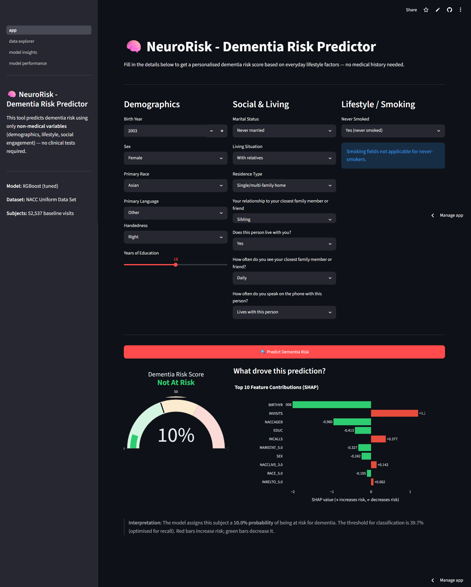
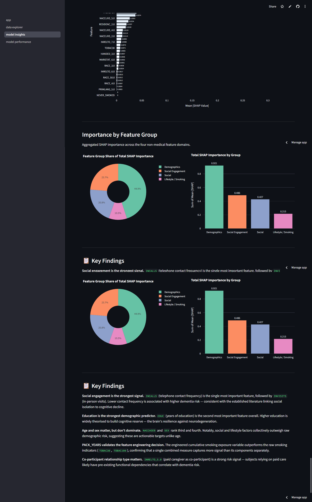
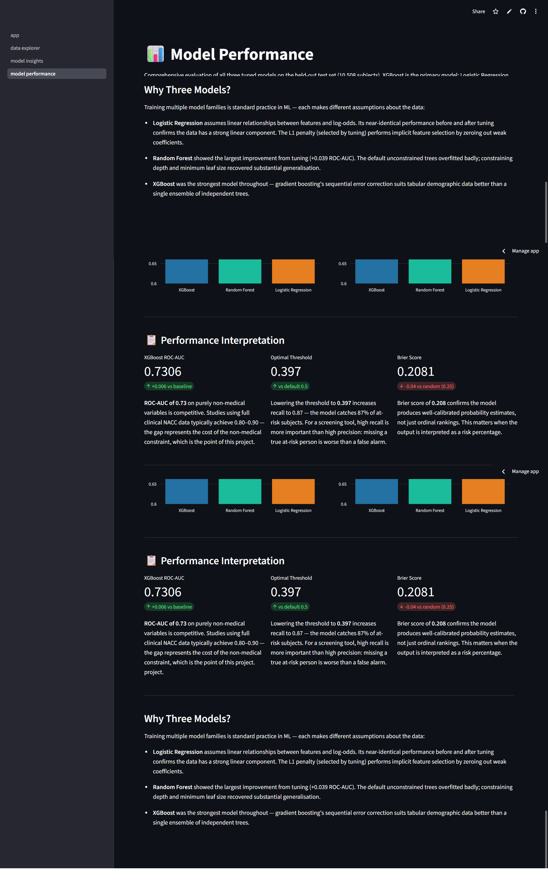
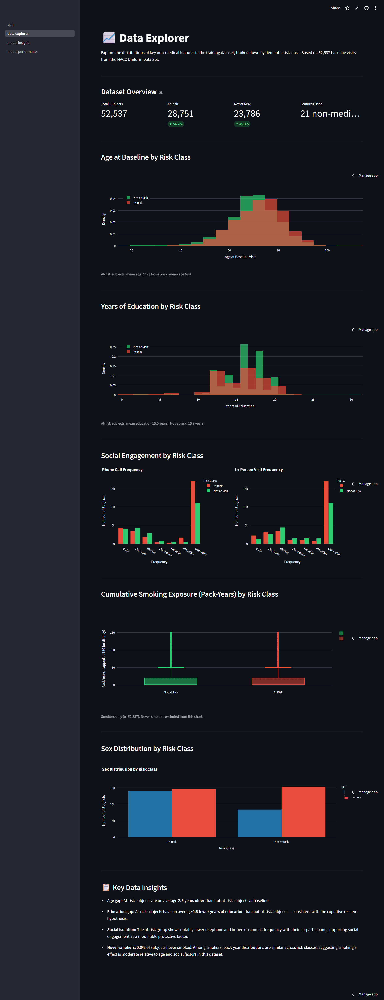

# 🧠 NeuroRisk — Dementia Risk Prediction from Non-Medical Variables

[](https://neurorisk-dementia-prediction.streamlit.app)
[](https://swetha2003-dementia-risk-api.hf.space/docs)
[](https://huggingface.co/Swetha2003/dementia-risk-model)
[](https://naccdata.org/)

A full-stack machine learning project that predicts dementia risk using **only non-medical variables** — demographics, lifestyle, and social engagement factors. No clinical tests, no medical history required.

> **ROC-AUC: 0.73 | PR-AUC: 0.77 | 52,537 subjects | XGBoost**

---

## 🌐 Live Demo

| | URL |
|---|---|
| **Web App** | [neurorisk-dementia-prediction.streamlit.app](https://neurorisk-dementia-prediction.streamlit.app) |
| **API** | [swetha2003-dementia-risk-api.hf.space/docs](https://swetha2003-dementia-risk-api.hf.space/docs) |

---
## 📸 Screenshots





---
## 🎯 Project Motivation

Most dementia risk models rely on clinical data — cognitive test scores, biomarkers, or diagnostic history — that require medical access and expertise. This project asks a different question:

> **Can we predict dementia risk from factors anyone can report — age, education, social contact, smoking history?**

Using the NACC Uniform Data Set (195,196 visits, 52,537 unique subjects), this project demonstrates that social and lifestyle signals alone achieve meaningful predictive performance, with social engagement emerging as the single strongest predictor.

---

## 🏗️ Architecture

```
NACC Dataset (195k rows, 1024 cols)
        │
        ▼
┌─────────────────────────────────┐
│       ML Pipeline (6 scripts)   │
│  EDA → Preprocess → Features    │
│  → Train → Tune → Evaluate      │
└──────────────┬──────────────────┘
               │  xgboost_tuned.pkl
               ▼
┌─────────────────────────────────┐
│    FastAPI Backend              │
│    Hugging Face Spaces          │
│    /predict  /explain           │
│    /metrics  /feature-importance│
└──────────────┬──────────────────┘
               │  REST API (JSON)
               ▼
┌─────────────────────────────────┐
│    Streamlit Frontend           │
│    Streamlit Community Cloud    │
│    Risk Predictor               │
│    Model Insights               │
│    Model Performance            │
│    Data Explorer                │
└─────────────────────────────────┘
```

---

## 📊 Results

| Model | ROC-AUC | PR-AUC | F1 (optimal) | Brier Score |
|---|---|---|---|---|
| **XGBoost (tuned)** | **0.7306** | **0.7656** | **0.7369** | **0.2081** |
| Random Forest (tuned) | 0.7256 | 0.7617 | 0.7336 | 0.2113 |
| Logistic Regression (tuned) | 0.7011 | 0.7363 | 0.7250 | 0.2195 |

> ROC-AUC of 0.73 using only non-medical variables. Studies using full clinical NACC data typically achieve 0.80–0.90 — the gap is the cost of the non-medical constraint.

### Top Features (SHAP)

| Rank | Feature | Mean |SHAP| | What it captures |
|---|---|---|---|
| 1 | `INCALLS` | 0.303 | Phone call frequency with closest contact |
| 2 | `EDUC` | 0.243 | Years of education |
| 3 | `SEX` | 0.196 | Sex |
| 4 | `NACCAGEB` | 0.176 | Baseline age |
| 5 | `BIRTHYR` | 0.158 | Birth year (cohort effects) |
| 6 | `INVISITS` | 0.131 | In-person visit frequency |
| 7 | `PACK_YEARS` | 0.104 | Engineered: years smoked × packs/day |
| 8 | `INRELTO_5.0` | 0.101 | Co-participant is a paid caregiver |

**Social engagement dominates.** Phone contact frequency is the single strongest predictor — lower contact correlates with higher risk, consistent with the established literature on social isolation and cognitive decline.

---

## 🗂️ Repository Structure

```
NeuroRisk/
├── backend/                    # FastAPI REST API
│   ├── main.py                 # API endpoints
│   ├── requirements.txt
│   ├── Dockerfile              # For Hugging Face Spaces
│   └── artefacts/              # Model artefacts (feature names, metrics, SHAP)
│
├── frontend/                   # Streamlit web app
│   ├── app.py                  # Main page: Risk Predictor
│   ├── requirements.txt
│   ├── data/                   # Processed dataset for Data Explorer
│   └── pages/
│       ├── 1_Model_Insights.py # SHAP global importance
│       ├── 2_Model_Performance.py  # ROC, PR, calibration
│       └── 3_Data_Explorer.py  # Feature distributions
│
├── 01_data_understanding.py    # EDA + feature selection
├── 02_preprocessing.py         # Sentinel recodes, baseline filter
├── 03_feature_engineering.py   # Imputation, encoding, PACK_YEARS
├── 04_model_development.py     # Train 3 model families
├── 05_hyperparameter_tuning.py # RandomizedSearchCV
├── 06_evaluation.py            # Metrics, SHAP, calibration
└── render.yaml                 # Render deployment config
```

---

## 🔬 Methodology

### Dataset
- **Source:** NACC Uniform Data Set (UDS), versions 1.2–3.2
- **Scope:** 195,196 visits from 52,537 unique subjects
- **Strategy:** Baseline-only (first visit per subject) to prevent temporal leakage

### Feature Selection
27 non-medical variables identified from the data dictionary across four domains:

| Domain | Variables |
|---|---|
| Demographics | Age, sex, race, education, birth year |
| Social | Marital status, living situation, residence type |
| Lifestyle/Smoking | Smoking history, pack-years (engineered) |
| Social Engagement | Visit frequency, call frequency, co-participant relationship |

### Key Preprocessing Decisions
- **NACC sentinel codes** (-4, 8, 9, 88, 99, 888) recoded to NaN per variable
- **Structural missingness:** TOBAC30/TOBAC100/SMOKYRS -4 (71,664 rows) → `NEVER_SMOKED` binary flag + zero-imputation
- **INVISITS/INCALLS code 8** ("lives with co-participant") → category 7, not missing
- **Dropped:** RACETER (99.5% missing), RACESEC (97.1%), HISPOR (91.2%), QUITSMOK (62.7%)

### Target Definition
`NACCUDSD` collapsed to binary: **at-risk = MCI (3) or dementia (4)**, not-at-risk = normal (1) or impaired-not-MCI (2). Resulting class balance: **54.7% / 45.3%** — no resampling required.

### Feature Engineering
- `PACK_YEARS = SMOKYRS × PACKSPER` — standard epidemiological smoking exposure measure
- `NEVER_SMOKED` — binary flag derived from structural missingness pattern
- One-hot encoding for 7 nominal categoricals (drop_first=True)

### Model Development
Three model families trained on an 80/20 stratified split with 5-fold CV:
- **Logistic Regression** (L1/L2, StandardScaler) — linear baseline
- **Random Forest** (class_weight='balanced') — tree ensemble
- **XGBoost** — gradient boosting, selected as primary model

Hyperparameter tuning via `RandomizedSearchCV` (50 iterations for XGBoost, 30 for others).

---

## 🚀 Running Locally

### ML Pipeline

```bash
git clone https://github.com/Swetha-Dewduni/NeuroRisk.git
cd NeuroRisk
pip install pandas numpy scikit-learn xgboost shap joblib

# Run scripts in order
python 01_data_understanding.py
python 02_preprocessing.py
python 03_feature_engineering.py
python 04_model_development.py
python 05_hyperparameter_tuning.py
python 06_evaluation.py
```

### Backend (FastAPI)

```bash
cd backend
pip install -r requirements.txt
uvicorn main:app --reload --port 8000
# Visit http://localhost:8000/docs
```

### Frontend (Streamlit)

```bash
cd frontend
pip install -r requirements.txt
# Update API_URL in app.py to http://localhost:8000
streamlit run app.py
```

---

## 📦 Tech Stack

| Layer | Technology |
|---|---|
| Data & ML | Python, pandas, scikit-learn, XGBoost, SHAP |
| API | FastAPI, Pydantic, uvicorn |
| Frontend | Streamlit, Plotly |
| Model hosting | Hugging Face Hub |
| Backend deployment | Hugging Face Spaces (Docker) |
| Frontend deployment | Streamlit Community Cloud |
| Version control | Git, GitHub |

---

## ⚠️ Limitations

- Trained on a **research cohort** (NACC) which skews older and more educated than the general population
- A **screening tool only** — not a clinical diagnostic instrument
- Non-medical features capture indirect proxies; direct medical assessment will always be more accurate
- Model performance should be interpreted in the context of the non-medical constraint

---

## 👩‍💻 Author

**K.K. Swetha Dewduni**
[GitHub](https://github.com/Swetha-Dewduni) · [Hugging Face](https://huggingface.co/Swetha2003)

---

## 📄 Data Source

Beekly, D.L., et al. (2007). The National Alzheimer's Coordinating Center (NACC) Database: The Uniform Data Set. *Alzheimer Disease and Associated Disorders*, 21(3), 249–258.
